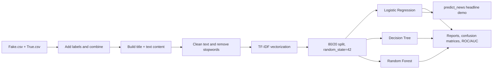

# Fake News Detector

**A reproducible notebook project that applies classical natural-language processing (NLP) to classify news articles as `fake` or `true`.** It combines text cleaning, TF-IDF features, and three scikit-learn classifiers, then compares their predictions with classification reports, confusion matrices, and ROC curves.

## Overview

The repository contains an end-to-end exploratory machine-learning workflow for binary news classification. The notebook loads the two labeled CSV files, combines each article's title and body into a `content` field, removes common textual noise, converts the corpus into a sparse TF-IDF matrix, trains three baseline classifiers, and exposes a small prediction function for a new headline.

This is a **notebook-based research/demo project**, not a packaged inference service. The repository does not contain a requirements file, serialized model, API, or frontend; models and the fitted vectorizer are created in notebook memory when the cells run.

## Features

- Loads `Fake.csv` and `True.csv` and assigns `fake`/`true` labels.
- Normalizes text by lowercasing, removing punctuation and numeric characters, and filtering English stopwords with NLTK.
- Explores word frequencies, article-length distributions, subject counts, and class labels.
- Builds TF-IDF features with scikit-learn.
- Trains Logistic Regression, Decision Tree, and Random Forest classifiers.
- Evaluates each model with classification reports, confusion-matrix heatmaps, and ROC/AUC plots.
- Demonstrates headline inference through `predict_news(...)`.

## Dataset

The existing project documentation identifies the files as the [Fake and Real News Dataset](https://www.kaggle.com/datasets/clmentbisaillon/fake-and-real-news-dataset) by Clément Bisaillon. The checked-in files have the following schema:

| File | Rows | Columns |
|---|---:|---|
| `Fake.csv` | 23,481 | `title`, `text`, `subject`, `date` |
| `True.csv` | 21,417 | `title`, `text`, `subject`, `date` |
| **Combined notebook input** | **44,898** | Adds derived `label` and `content` fields |

The notebook's exploratory output is dominated by political/news subjects, including `politicsNews`, `worldnews`, `News`, and `politics`. Treat the reported scores as corpus-specific rather than evidence of broad real-world fact-checking ability.

## Project Structure

```text
.
├── Fake.csv                 # Labeled fake-news articles
├── True.csv                 # Labeled real-news articles
├── fake_news_model.ipynb    # Data preparation, EDA, training, evaluation, and demo
└── README.md
```

## Workflow



## Tech Stack

- **Python** in Jupyter Notebook or Google Colab.
- **pandas** and **NumPy** for tabular data preparation.
- **NLTK** for English stopwords.
- **scikit-learn** for TF-IDF, train/test splitting, classifiers, and metrics.
- **Matplotlib** and **seaborn** for visual analysis and evaluation plots.

## Setup and Usage

1. Clone the repository and enter it:

   ```bash
   git clone https://github.com/Anas-S-Muhammed/Fake_News_Detector_model.git
   cd Fake_News_Detector_model
   ```

2. Install the libraries imported by the notebook. No `requirements.txt` or environment lockfile is included, so pin versions if you need a reproducible environment:

   ```bash
   python -m pip install pandas numpy scikit-learn nltk matplotlib seaborn jupyter
   ```

3. Launch Jupyter and open `fake_news_model.ipynb`:

   ```bash
   jupyter notebook fake_news_model.ipynb
   ```

4. Run the cells in order. The notebook downloads NLTK's English stopword corpus in a cell, trains the models in memory, and prints/plots the exploratory and evaluation outputs.

The final notebook cell defines and calls:

```python
def predict_news(headline):
    headline = headline.lower()
    headline = vectorizer.transform([headline])
    prediction = lr.predict(headline)
    return prediction[0]

predict_news("Trump claims election was stolen")
# 'fake' in the saved notebook output
```

## Results and Current Status

The notebook's saved outputs show an 80/20 split with **8,980 test examples**. The reported test-set classification metrics are:

| Model | Accuracy | F1 score | ROC-AUC shown in notebook |
|---|---:|---:|---:|
| Logistic Regression | 0.99 | 0.99 | 1.00 |
| Decision Tree | 1.00 | 1.00 | 1.00 |
| Random Forest | 0.99 | 0.99 | 1.00 |

These results are useful as a baseline, but they should not be interpreted as production-grade misinformation detection. The notebook fits `TfidfVectorizer` on the full combined corpus before the train/test split, so the evaluation is affected by feature-level data leakage. The perfect Decision Tree result is also consistent with possible overfitting. In addition, one exploratory cell assigns `true_counts` from `fake_words`, so the saved “true” word-frequency output should be treated cautiously.

## Limitations

The notebook relies on surface-level word patterns and does not model source credibility, factual evidence, context, sarcasm, or temporal language drift. The corpus is concentrated in US political/news content, and the repository does not include external or time-based validation. There is no persisted model artifact or application layer for serving predictions.

## Future Improvements

- Fit the TF-IDF vectorizer only on `X_train`, preferably inside a scikit-learn `Pipeline`, and add a leakage-safe validation protocol.
- Correct the exploratory `true_counts` calculation and add automated tests for preprocessing and inference.
- Report per-class precision, recall, F1, support, and confusion-matrix counts in a reproducible results artifact.
- Add cross-domain and temporal holdout evaluation to measure generalization beyond this corpus.
- Compare the classical baseline with a calibrated linear model or a transformer baseline.
- Persist the vetted pipeline and add a documented API or user interface only after external validation.

## References

[1]: https://www.kaggle.com/datasets/clmentbisaillon/fake-and-real-news-dataset "Fake and Real News Dataset"

The repository contains the dataset files directly; the external dataset page is provided for provenance and license/context review.
